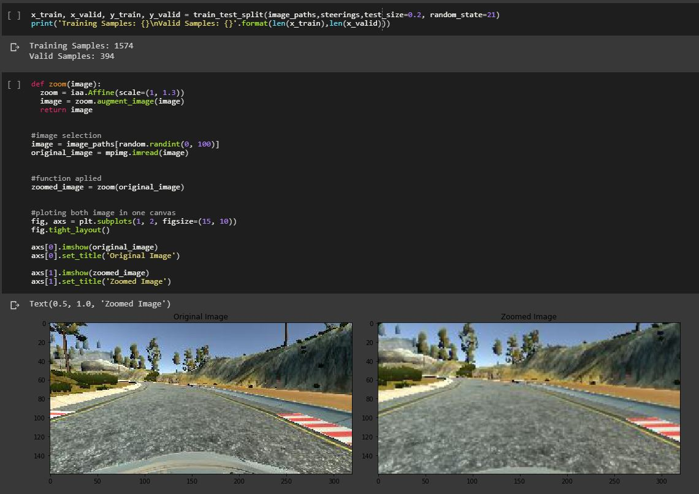

# Self-Driving-Car-Prototype : with basic approach
We need to send steering, acceleration, and brake commands to move the car.
Here is a small part of control of self driving car which is done using two features : 1.CENTRE   2.STEERING

---
#### Coded in Google Colaboratory
#### Data is trained using Self Driving Car Simulator of Udacity
[SELF DRIVING CAR SIMULATOR-UDACITY](https://github.com/udacity/self-driving-car-sim)

Training Data consists of a csv file with the recorded movements of car and images while training.
However, the data is not trained much because it of the large data file and hence the accuracy of this trained data is 
```
Epoch 1/5
300/300 [==============================] - 850s 3s/step - loss: 0.1248 - acc: 0.2094 - val_loss: 0.1024 - val_acc: 0.1946
Epoch 2/5
300/300 [==============================] - 251s 837ms/step - loss: 0.0959 - acc: 0.2090 - val_loss: 0.0878 - val_acc: 0.1970
Epoch 3/5
300/300 [==============================] - 249s 830ms/step - loss: 0.0831 - acc: 0.2180 - val_loss: 0.0832 - val_acc: 0.1881
Epoch 4/5
300/300 [==============================] - 247s 825ms/step - loss: 0.0782 - acc: 0.2197 - val_loss: 0.0848 - val_acc: 0.1919
Epoch 5/5
300/300 [==============================] - 247s 825ms/step - loss: 0.0757 - acc: 0.2173 - val_loss: 0.0904 - val_acc: 0.1934
---
```
### Libraries Used
* os
* matplotlib
* numpy
* keras
* scikit
* imgaug
* pandas
* opencv

---

The full code is available [here](/self_driving_car_.ipynb). 
Here are some screenshots of codes :


---


---


---


---


---

